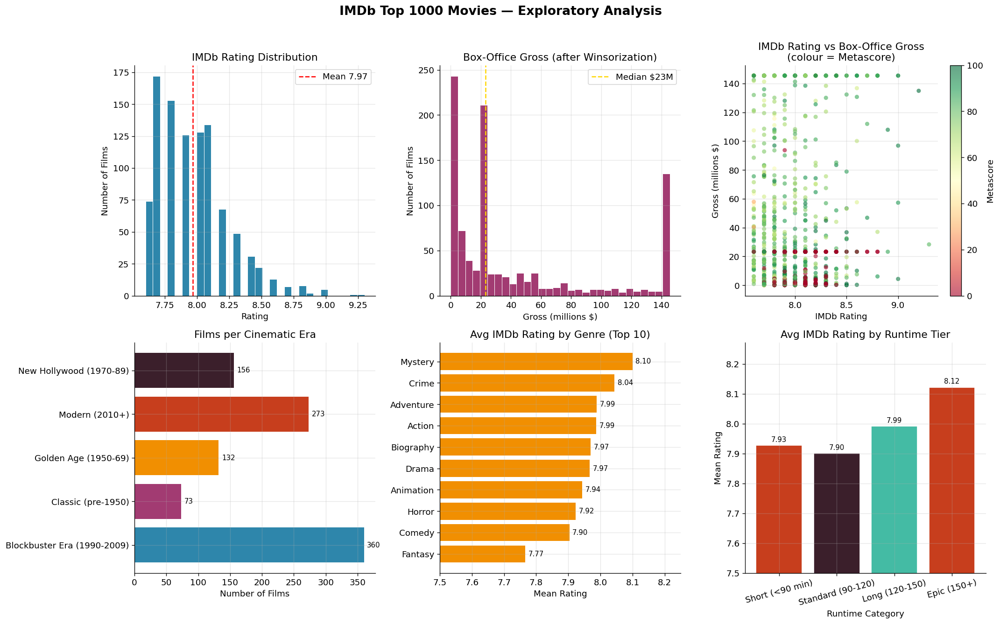

# IMDb Top 1000 Movies — Exploratory Data Analysis & Recommendation System

<p align="center">
  
</p>

---

## Project Overview

This project presents a complete Data Analysis and Recommendation System pipeline built using the IMDb Top 1000 Movies Dataset with Python.

The workflow covers the full data science lifecycle:

* Data Cleaning & Preprocessing
* Exploratory Data Analysis (EDA)
* Feature Engineering
* Statistical Analysis
* Content-Based Recommendation System

The project transforms raw movie data into meaningful insights and a functional movie recommendation engine.

---

# Project Objectives

* Perform end-to-end Exploratory Data Analysis (EDA)
* Clean and preprocess real-world movie data
* Engineer meaningful features for analysis and modeling
* Detect and handle outliers statistically
* Analyze movie rating and revenue patterns
* Build a Content-Based Movie Recommendation System
* Generate insights through data visualization

---

# Dataset Description

The dataset contains information about IMDb Top 1000 movies, including:

| Feature        | Description                      |
| -------------- | -------------------------------- |
| `title`        | Movie name                       |
| `director`     | Movie director                   |
| `release_year` | Release year                     |
| `runtime`      | Duration in minutes              |
| `genre`        | Movie genres                     |
| `rating`       | IMDb user rating                 |
| `metascore`    | Critics’ score                   |
| `gross`        | Box office revenue (Million USD) |

---

# Data Preprocessing

The dataset underwent a complete preprocessing pipeline:

### Missing Value Handling

* Missing `gross` values were filled using median imputation

### Duplicate Removal

* Duplicate movie titles were identified and removed

### Data Type Conversion

* Converted text-based numeric columns into proper numerical formats

### Outlier Detection

* Applied the Interquartile Range (IQR) method

### Winsorization

* Extreme values were capped instead of removed to preserve dataset integrity

---

# Feature Engineering

Several new features were created to improve both analysis and recommendations:

| Feature             | Purpose                                 |
| ------------------- | --------------------------------------- |
| `primary_genre`     | Extract main genre                      |
| `era`               | Classify movies into cinematic eras     |
| `rating_tier`       | Categorize movies by quality            |
| `gross_tier`        | Revenue segmentation                    |
| `rating_zscore`     | Standardized ratings                    |
| `runtime_norm`      | Normalized runtime                      |
| `combined_features` | Text representation for recommendations |

---

# Exploratory Data Analysis (EDA)

The project includes detailed statistical and visual analysis.

## Key Insights

* IMDb ratings are concentrated within a narrow high-quality range
* Revenue distribution is highly skewed due to blockbuster movies
* Weak correlation exists between ratings and box office revenue
* Genre and cinematic era influence ratings more than revenue
* Runtime has limited impact on movie quality perception

---

# Visualizations

The analysis dashboard includes:

* IMDb Rating Distribution
* Box Office Revenue Distribution
* Rating vs Gross Revenue Scatter Plot
* Movies per Cinematic Era
* Average Rating by Genre
* Runtime Tier vs Rating Analysis

---

# Recommendation System

## Approach: Content-Based Filtering

A movie recommendation engine was built using:

* TF-IDF Vectorization
* Cosine Similarity

---

## How It Works

Each movie is converted into a textual feature representation using:

* Genre
* Director
* Rating Tier
* Era

The workflow:

1. Combine movie features into text
2. Convert text into numerical vectors using TF-IDF
3. Compute similarity scores between movies
4. Recommend the most similar movies

---

## Example Recommendation

### Input:

```python
recommend_movies("The Dark Knight")
```

### Output:

* Batman Begins
* Inception
* Joker
* Interstellar

---

# Technologies Used

* Python
* Pandas
* NumPy
* Matplotlib
* Scikit-learn

---

# Project Structure

```bash
IMDb-Movie-Recommendation-System/
│
├── datasets/
│   ├── imdb_raw.csv
│   └── imdb_clean6.csv
│
├── notebooks/
│   ├── imdb_analysis.ipynb
│   └── movie_recommender.ipynb
│
├── assets/
│   └── imdb_analysis.png
│
├── README.md
│
└── requirements.txt
```

---

# Key Learnings

This project strengthened practical skills in:

* Data Cleaning & Preprocessing
* Statistical Analysis
* Feature Engineering
* Data Visualization
* Recommendation Systems
* Machine Learning Pipelines

---

# Future Improvements

* Hybrid Recommendation System
* Collaborative Filtering
* Streamlit Web App
* Interactive Dashboard
* Real-time Movie Search

---

# Conclusion

This project demonstrates a complete real-world data science workflow that combines:

> Data Analysis → Machine Learning → Recommendation Systems

It highlights how raw movie data can be transformed into valuable insights and intelligent recommendations.

---

# Author

## Ganna Amr Emad Eldin

Faculty of Artificial Intelligence

Interested in:

* Data Science
* Machine Learning
* AI-driven Systems
